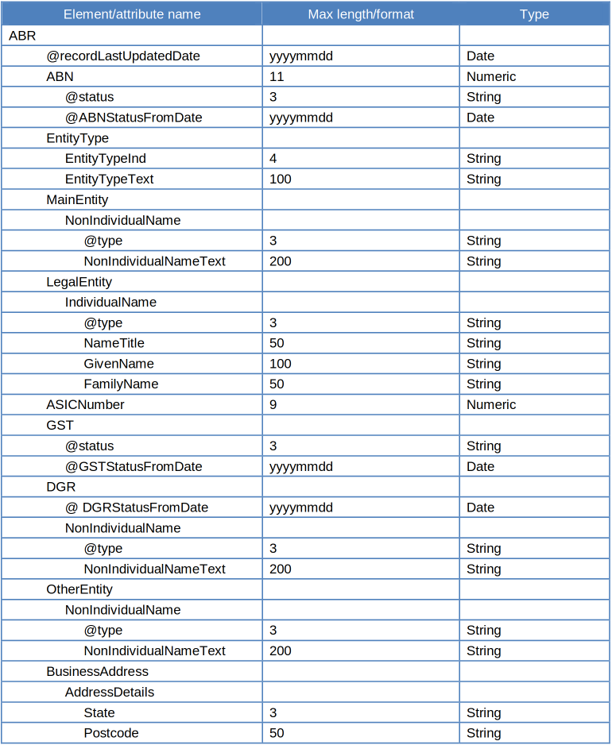
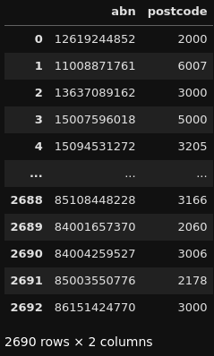

+++
title = 'ABN Postcode Extractor (Corporate Tax Transparency Analysis - Part 2)'
date = 2024-10-18T18:52:29+11:00
draft = false
projects = ['corporate-tax-transparency-analysis']
+++

*This is Part 2 of a three-part series. You can find the previous part [here](https://hbbymth42.github.io/posts/asgs-geonames-pipeline-corporate-tax-transparency-analysis-part-1/). :)*

Continuing on from the previous part, we are going to jump to another dataset. The previous part contains more technical information around geospatial mapping and not too much of a focus on the data I am trying to analyse.

Hence, this part will have more of a focus on the data I wish to analyse: The [2021-22 Corporate Tax Transparency Report](https://data.gov.au/data/dataset/corporate-transparency) released by the Australian Taxation Office (ATO).

Additionally, this part will also focus on another dataset which I intend to use to enhance this data: The [ABN Bulk Extract](https://data.gov.au/data/dataset/abn-bulk-extract) released by the Australian Business Register (ABR).

Far out, another dataset?! How many of these things are you gathering? Well, there's a reason for picking this specific dataset.

If you recall my previous post, remember how we can get the main business location postcode from an entity's Australian Business Number (ABN). Well, rather than manually gathering this data by searching every single ABN from the Corporate Tax Transparency Report, we have a way to automate this data collection!

Let's start with a bit of background on the ABN Bulk Extract.

## The ABN Bulk Extract... saving time with yet ANOTHER dataset

The ABN Bulk Extract is a weekly-updated dataset which contains publicly available information provided by businesses when they register for an ABN. There are a number of attributes that this dataset gathers but the one we are particularly interested in is postcodes.

This dataset, most importantly, contains valid states and postcodes listed under relevant ABNs, provided the ABN holder has submitted this information.

For the structure of the extract itself, it is distributed as a collection of XML files, following this structure:


This looks... like a lot, but as you can quickly tell, we are interested in the bottom row. The indenting of the names of these attributes is intentional. If you have ever worked with an HTML web page (you can see one for yourself by right-clicking and inspecting this web page ;) ), XML data is structured similarly.

The indents in this case represent which attributes are nested in other ones (i.e. ABN is found by first getting ABR, then going to ABN so, ABR -> ABN).

So, in order to get to the postcode, this is the path that we do so: ABR -> BusinessAddress -> Postcode.

Now, we know what we want, let's get to the code!

## The Code... Wow! That was quicker than expected!

The code here, similarly to the ASGS GeoNames code, is actually also relatively simple.

Part of the code involves getting the 2021-22 Corporate Tax Transparency Report and creating a list of ABNs to search on.

For this post, I'll focus on the postcode searching code:
```python
abn_info_dict = {'abn_abr': [],
                 'postcode': []
                }

xml_root = ET.parse('20241016_Public01.xml').getroot()

for record in xml_root.iter('ABN'):
    abn_info_dict['abn_abr'].append(record.text)

for record in xml_root.iter('Postcode'):
    abn_info_dict['postcode'].append(record.text)

abn_info_df = pd.DataFrame.from_dict(abn_info_dict)

del abn_info_dict

abn_merge = (abn_list_df
             .merge(abn_info_df, how='left', left_on='abn_tax', right_on='abn_abr')
             .reset_index(drop=True)
            )

del abn_list_df

abn_merge_success = (abn_merge
                     .query('not(abn_abr.isna())')
                     .reset_index(drop=True)
                    )

abn_merge_unsuccessful = (abn_merge
                          .query('abn_abr.isna()')
                          .drop(columns=['abn_abr', 'postcode'])
                          .reset_index(drop=True)
                         )
del abn_merge
```

We start with the first XML file from the ABN Bulk extract (named ```..._Public01.xml```).

A dictionary is contructed based on the information we can find by addressing the relevant attributes in the file to get ABNs and their linked main business address postcodes.

Once we have this dictionary, we convert it to a Pandas DataFrame and attempt to merge it with the list of ABNs from the Corporate Tax Transparency Report.

If matches are found, that is a successful find! Where matches are unsuccessful, we create a separate DataFrame for them and loop through the remaining XML files in the bulk extract, as seen below:
```python
for xml in glob.glob('*.xml'):
    abn_info_dict = {'abn_abr': [],
                     'postcode': []
                    }
    
    xml_root = ET.parse(xml).getroot()
    
    for record in xml_root.iter('ABN'):
        abn_info_dict['abn_abr'].append(record.text)
    
    for record in xml_root.iter('Postcode'):
        abn_info_dict['postcode'].append(record.text)
    
    abn_info_df = pd.DataFrame.from_dict(abn_info_dict)
    
    del abn_info_dict  
    
    abn_merge = (abn_merge_unsuccessful
                 .merge(abn_info_df, how='left', left_on='abn_tax', right_on='abn_abr')
                 .reset_index(drop=True)
                )
    
    abn_merge_success = (pd.concat([abn_merge_success, abn_merge.query('not(abn_abr.isna())')])
                         .reset_index(drop=True)
                        )

    if abn_merge.query('abn_abr.isna()').shape[0] == 0:
        break

    abn_merge_unsuccessful = (abn_merge
                              .query('abn_abr.isna()')
                              .drop(columns=['abn_abr', 'postcode'])
                              .reset_index(drop=True)
                             )
    del abn_merge

del abn_merge

abn_found_postcodes = (abn_merge_success
                       [['abn_tax', 'postcode']]
                       .query('not(postcode.isna())')
                       .rename(columns={'abn_tax': 'abn'})
                      )
```

Once all the relevant XML files have been checked and all possible ABNs' postcodes have been found, we filter the list down to only successful matches with valid postcodes, here's a sample:


The found postcodes are then merged back to the original Corporate Tax Transparency Data, for use in... what will be detailed in the next and final post: geospatial mapping!


## Concluding Remarks

Thank you once again for sticking through this post! If you want to see more of this code, you can find it [here](https://github.com/hbbymth42/abn_postcode_extractor)!.

I hope that you'll join me for the next post as this will be where this project will start to get really interesting!

--HobbyMath42
