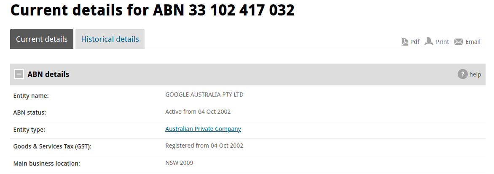
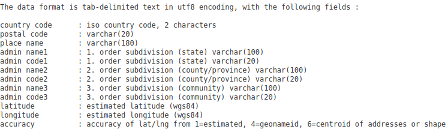
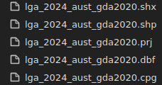

+++
title = 'ASGS GeoNames Pipeline (Corporate Tax Transparency Analysis - Part 1)'
date = 2024-10-16T16:02:29+11:00
draft = false
projects = ['asgs-geonames-pipeline','corporate-tax-transparency-analysis']
+++

Alright, time for a new project!

Well, sort of two new projects!

This post specifically is effectively a beginning of sorts, starting out as both the first part of a larger whole, as well as the start of another whole in itself!

The tl;dr of this post is that I wanted to create a pipeline for geospatial analysis of Australian-specific datasets (I'll get into why this is the case soon enough)!

And I... have done that! Explaining how I have done so requires a fair amount of background (interesting background, I assure you!), and that's what this post is for!

The intention of creating such a pipeline was (as you may be able to gather from the title), to analyse Corporate Tax Transparency Data from a Geospatial perspective. To get even more specific, I wanted to understand how much income was earned by companies in Australia, how much of that income was taxable and how much tax had been paid on said income.

I'll leave the background of how I obtained such data for a later post and the technical detail about the structure of that data, but the component of this project which is relevant for this post is the geospatial element! I want to analyse these metrics by Local Government Area (LGA) as it pertains to Australia.

Now, what does this all mean? Let's dive into it!

## Background - Local Government Areas and Geospatial... Quirkiness

Time to get technical!

Let's start with the data we are trying to analyse: Corporate Tax Transparency Data. Suffice to say, this data does not include *any* geospatially related data points. No latitudes, no longitudes, none of that. So, question is... how do we geospatially analyse data that has no geospatial characteristics?

The answer: You bring geospatial elements to the data... But how do we do that?

The answer to that follow-up question: Postcodes!

Alright, that was a very quick and somewhat confusing explanation, so let me clarify further!

In the Corporate Tax Transparency Data, there is a way we can get geospatial data into this dataset, and, for this project, the way to do so is through the Australian Business Number (ABN).

Without getting too bogged down in the details, ABNs typically have a main business address listed which contains a postcode, as can be seen here:


Notice the four-digit number after NSW under 'Main business location'? That's what we want! This gives us the location of the main business associated with this ABN.

With this postcode, we can get a latitude and longitude to represent this location! How do we do that? We can use a dataset called [GeoNames](https://www.geonames.org/).

GeoNames is a geographical database which covers all countries and contains placenames & postcodes pertaining to each country in the database.

We are interested in Australian Postcodes, and we can get them from GeoNames, with a latitude and longitude associated with them!



BAM! Now we have geospatial data... but there's one thing we didn't touch on yet. Latitude and Longitude represent a point on a map, not an area. Guess I forgot about the 'Area' part of 'Local Government Area'! Whoops!

You would have also noticed that the above structure does not include a 'Local Government Area' field either so what do we do?

Fear not, the Australian Bureau of Statistics (ABS) has us covered!

In 2021, the ABS published a standard which classifies Australia into a hierarchy of statistical areas, based on societal understandings which reflect the location of people and various communities. This is called the [Australian Statistical Geography Standard](https://www.abs.gov.au/statistics/standards/australian-statistical-geography-standard-asgs-edition-3/jul2021-jun2026) (ASGS... hey, that's part of the title of this post!).

More importantly, the ASGS contains 'digital boundary files' which represent Australia split up differently depending on how you would like to view Australia (as you can see [here](https://www.abs.gov.au/statistics/standards/australian-statistical-geography-standard-asgs-edition-3/jul2021-jun2026/access-and-downloads/digital-boundary-files). For the sake of the Corporate Tax Transparency Analysis project, we are only interested in the Local Government Area boundary, but as you can quickly gather from my explanation, this has a variety of use cases!

Hence, why the development of this pipeline is a project in itself, but I'm getting ahead of myself. How are digital boundaries defined? Well, that is an interesting and somewhat complicated question.

Boundaries are defined by datums and the datum used for the ASGS digital boundary files is GDA2020 (Geocentric Datum Australia 2020). This seems like a relatively minor point but it becomes significant when trying to produce maps.

Each country has its own datum and this defines how both points and geometric polygons are plotted on a map. Think of it like trying to do analysis of mountains from a simple map that only shows capital cities. The map used here is not appropriate for analysis and a map with mountains plotted would be more relevant.

Hence, the datum and an appropriate definition is very important (for more on Australia's datum, see [here](https://www.icsm.gov.au/gda2020)). Additionally, as somewhat touched on with the mountains example, each datum has a Coordinate Reference System depending on the type of map you are producing. [Referring to the technical manual for GDA2020](https://www.icsm.gov.au/sites/default/files/GDA2020%20Technical%20Manual%20V1.8_published_0.pdf), the Coordinate Reference System (CRS) corresponds with EPSG Code 7844 (I promise, this will be important later).

Now, back to the project itself, I want to geospatially code postcodes and get the relevant ASGS boundary files to use for later analysis. Which now brings us to, what I'm sure we've all been waiting for... the code!

## The Code! Took us long enough!

The code for this particular part of the project is actually relatively simple! I know, that long winded explanation made it sound like this was going to be very complicated, but it's actually relatively straightforward!

But... before I get into the specific parts of the code, I'll quickly provide a bit of background to one more aspect of this project: GeoPackage Files. GeoPackage files are a way to store geometry for mapping, with these files being typically large files with multiple 'layers'. The ASGS boundary files can be gathered in one of two ways:
1. Reading each of the layers of the available GeoPackages
2. Gathering each individual Shapefile (another file format used to store geometry for mapping)

For this project, I opted to use the first option both because it would make more interesting code and it would be simpler to get each individual file from a smaller pool of files with layers!

To read the GeoPackage files and geo-code the postcodes from GeoNames, I used a python library called [GeoPandas](https://geopandas.org/en/stable/index.html). This library allows us to work with geospatial data in a variety of file formats!

A lot of the code is downloading the relevant files and getting the files ready for later use, but I'll touch on some more of the interesting parts of the code.

Let's start with GeoNames Postcodes:
```python
au_postcodes_gdf = (gpd.GeoDataFrame(au_postcodes_df, geometry=gpd.points_from_xy(au_postcodes_df['longitude'], au_postcodes_df['latitude']), crs="EPSG:7844")
                    [['postal_code', 'place_name', 'geometry']]
                    .drop_duplicates(ignore_index=True)
                   )

au_postcodes_path = pathlib.Path(outputs_path / 'au_postcodes')

au_postcodes_path.mkdir(exist_ok=True)

au_postcodes_gdf.to_file(au_postcodes_path / 'au_postcodes.shp')
```

Relatively straightforward but note that the code takes a Pandas DataFrame and adds references to X,Y points, as well as encodes the relevant reference system required (```crs="EPSG:7844"```).

This 'GeoDataFrame' looks like this:


Note the geometry column references a x,y coordinate. This means that the latitude and longitude from GeoNames has now been encoded as a geometric object to be used for mapping!

Similarly, we can also do this on each layer of a GeoPackage file we give to GeoPandas, as is done in this block of code:
```python
for layer in pyogrio.list_layers(path):
    asgs_gdf = (gpd.read_file(path, layer=layer[0])
                .query('not(geometry.isna())')
                .drop_duplicates(ignore_index=True)
               )

    asgs_gdf = (asgs_gdf
                [[asgs_gdf.columns[0], asgs_gdf.columns[1], 'geometry']]
                .rename(columns={asgs_gdf.columns[0]:asgs_gdf.columns[0].lower(),
                                 asgs_gdf.columns[1]: asgs_gdf.columns[1].lower()
                                }
                       )
                .drop_duplicates(ignore_index=True)
               )
    
    asgs_path = pathlib.Path(outputs_path / f'{layer[0].lower()}')
    
    asgs_path.mkdir(exist_ok=True)
    
    asgs_gdf.to_file(asgs_path / f'{layer[0].lower()}.shp')
    
    del asgs_gdf
    
    with ZipFile(outputs_path / f'{layer[0].lower()}.zip', mode='w') as archive:
        for file in asgs_path.iterdir():
            archive.write(file, arcname=file.name)
            file.unlink()
    
    asgs_path.rmdir()
    
    del asgs_path
    
    print(f'Saved {layer[0]} to Shapefile!')
```
For this specific project, this block of code takes an ASGS GeoPackage file and creates a GeoDataFrame for each layer, which is then subsequently saved as an individual Shapefile.

Quick sidenote, outputting to .shp as is done here creates multiple files, all of which create the geometry and labels associated with that geometry (such as name, associated code, etc.) and all of these files need to be read together in order to reproduce the GeoDataFrame that the relevant files came from.

Here's a sample of what comes out of saving a GeoDataFrame as a Shapefile:


All of these files need to be read together and they are best read as a consolidated Zip file!

## Concluding Remarks

That about covers it really!

As mentioned, the Corporate Tax Transparency Analysis aspect of this mini-project continues with subsequent posts, so be sure to check them out if you're interested in seeing where this goes!

I might revisit this specific project again to make some fixes or even apply some improvements as I see them but for the time being, this is where we end

Thank you so much for sticking through to the end of this somewhat wordy post. I hope that this breakdown will help you out for similar projects you may have in mind!

-- HobbyMath42
