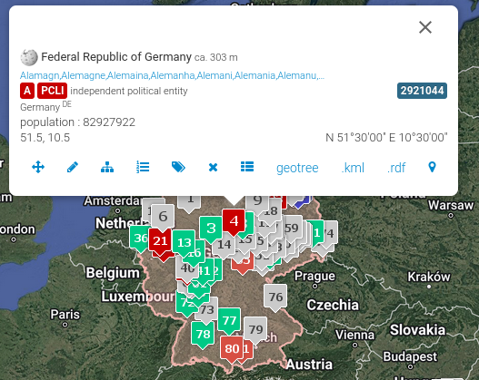

+++
title = 'Favourite Music Releases Visualiser - The Data (Part 1)'
date = 2024-09-26T16:09:59+10:00
draft = false
projects = ['favourite-music-releases-visualiser']
+++

So... This is my first proper project that I have completed! (outside of this website)

I have enjoyed listening to music of various genres ever since I can remember!

I will likely make another post about my music listening journey but to keep things short, I wanted a way to keep a list of my favourite music albums, LPs, Soundtracks, etc., in one place! 

Hence, this project is my attempt to do so while also gaining some insight into my current music tastes and potentially, identify gaps that I want to fill!

To get a bit technical, this project is mainly Python-based, utilising a framework/platform called [Streamlit](https://streamlit.io/).

Streamlit allows a user to take some Python code and create either a single-page or multi-page web application. Streamlit is mainly used for data-related projects like producing Dashboards and Data Analysis. 

In short, this is the perfect framework to use for what I want to do!

This post will therefore, act as initial documentation for this project. From sourcing & structuring the data, to visualising the data with Streamlit.

Now, with all that brief context out of the way, let's get started!

## The Data Model
Let's begin where all good data projects begin... the data.

Sourcing the data is somewhat manual given the nature of this project.

When sourcing the data, I had two big considerations in mind:
1. I want the data structures to be able to be linked to other sources to ensure interoperability should I want to expand this project further.
2. The data itself should be of reliable enough quality such that I am able to verify the various details I want to visualise.

On the second point, I wanted to start simple with the visualisations. Hence, why the end product only contains two visuals:
1. Artists by Country
2. Releases by Year/Decade

Starting with these two visuals as the goal, this is the Entity Relationship Diagram for the data sitting behind the visualiser


The primary keys for the main tables (**releases** & **artists**) are not typical incrementing primary keys. Instead, these are identifiers for an Artist and Releases respectively from [MusicBrainz](https://musicbrainz.org/).

MusicBrainz is an open-source encyclopedia of various music artists and releases (they also have a Python library which interfaces with their API... could be useful for another project in the future! 👀)

For uniqueness, MusicBrainz generates identifiers for each relevant entity as required. For example, let's take an album I am listening to as I'm writing this: OIL OF EVERY PEARL'S UN-INSIDES by SOPHIE and get the relevant identifiers from MusicBrainz.

SOPHIE's identifier is '774b02d7-5056-4b0f-9d69-a82b6ae27cde' as seen here:


Similarly, taking the first release we can see for OIL OF EVERY PEARL's UN-INSIDES, we get '957806d5-1053-4c2a-ac2c-539d54d4dc23' as the identifier:


These identifiers are unique and immutable and, therefore, are great candidates for primary keys!

Additionally, as you can probably gather from the screenshots, we can also source other relevant information such as Artist Country, Release Date, Release Type, etc., just from looking at MusicBrainz!

Now, for **countries**.

For this table, data was mainly sourced from [Geonames](https://www.geonames.org/), which is a Geographical database covering all countries. Placenames, post/postal codes, country codes and everything in between!

For this specific project, it was found that the ISO 3166-1 alpha-3 codes were found to be sufficient enough map relevant entities to country areas. In this case, an artist's birth country/country of origin.

However, I did want to get more information about relevant countries to assist with potentially, expanding this project further (remember point 1 of my big considerations?) and thus, I wanted to also gather latitudes and longitudes!

Now, you may be asking, what is the latitude and longitude of Japan? Or England? Aren't these more appropriately, areas rather than points on a map? Well, that's a great observation! Hence, considering this further, some interpretation of Geonames would be required to account for this fact.

We need a consistent latitude and longitude which would specifically identify a country (i.e. be situated in a location on a map that is either central or is roughly equivalent to identifying a country). The candidate that was chosen from Geonames was the PCLI (independent political entity) feature code latitude and longitude.

Here's a sample for Germany:


To make this latitude and longitude combination more specifically identifiable, we can take the number that is highlighted in dark-blue, which I have noted as the *geonameid*.

To fully complete this table, the 3-letter ISO-3166 code was used as a primary key, specifically to join with the artist's birth country/country of origin (noted as *artist_country* in the **artists** table).

Finally, since multiple releases can be associated with multiple artists, a surrogate table called **releases_artists** was created to manage this many-to-many relationship.

## Storage & Query Structuring

Given that the size of this dataset and to keep the parts of this project simple, I have opted to use [SQLite](https://www.sqlite.org/index.html) as the database engine of choice. Using [SQLAlchemy](https://www.sqlalchemy.org/), I can use Python to interact (and specifically, query) with the aforementioned data structure.

The final visualisations will be discussed in the following blog post but to keep this post relevant to the data sitting behind the visuals, the following queries are used as the basis for the relevant visuals that come up in the application:
1. Releases by Year (Bar & Horizontal Chart, and Table):
    ```sql
    SELECT DISTINCT r.release_title
              , a.artist_name
              , r.release_type
              , r.release_date
    FROM releases r
    INNER JOIN releases_artists ra
        ON r.release_mbid = ra.release_mbid
    INNER JOIN artists a
        ON ra.artist_mbid = a.artist_mbid
    ORDER BY r.release_date, r.release_title, a.artist_name
    ```
2. Artists by Country (Choropleth Map)
    ```sql
    SELECT c.country_code
         , c.country_name
         , COUNT(DISTINCT a.artist_name) AS num_artists
    FROM countries c
    INNER JOIN artists a
    ON c.country_code = a.artist_country
    GROUP BY c.country_code, c.country_name
    ORDER BY num_artists DESC
    ```
3. Artist by Country (Table)
    ```sql
    SELECT a.artist_name
         , c.country_name
    FROM artists a
    LEFT JOIN countries c
    ON a.artist_country = c.country_code
    ORDER BY a.artist_name
    ```

These queries are structured in a way which can be easily used and/or transformed to suit the structure that the relevant visual requires.

And... that covers it! Thanks for sticking through so far! If you want to keep reading on to find out more about the visuals, see [Part 2](../favourite-music-releases-visualiser-visualisation-part-2/index.html)!
