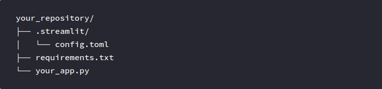
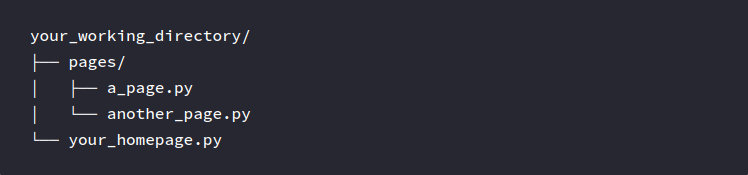
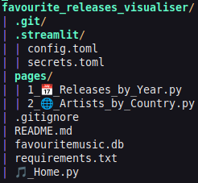
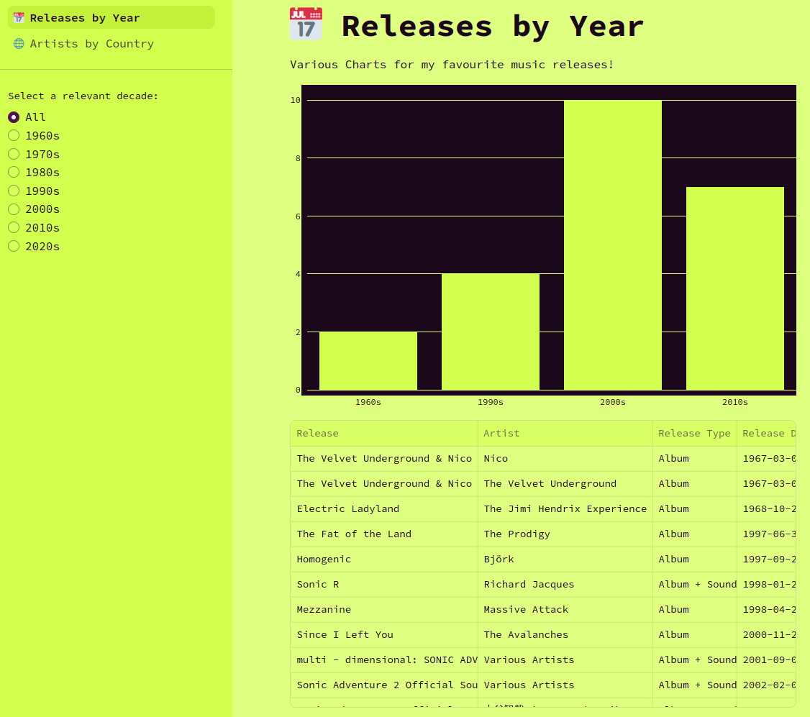

+++
title = 'Favourite Music Releases Visualiser - Visualisation (Part 2)'
date = 2024-09-27T11:04:48+10:00
draft = false
projects = ['favourite-music-releases-visualiser']
+++

*This is Part 2 of the Favourite Music Releases Visualiser Project Series, see Part 1 if you missed it [here](../favourite-music-releases-visualiser-the-data-part-1/index.html)!*

Continuing on from the previous blog post in this series, with the relevant queries produced and ready for use, it's time to dive into Python & Streamlit!

## Streamlit Directory Structure and Setup
As discussed in the prior post, Streamlit is a framework which can take Python code and turn it into a single page or multi-page web application, without the need for JavaScript or its respective frameworks/libraries.

A basic structure for a single page app would typically follow this structure (which I have similarly adapted to render my multi-page app):


For a multi-page app, we simply add a **pages** directory and point the deployment of the app to an 'entrypoint' file:


*For more on information on Streamlit's inner workings, give the very friendly [docs](https://docs.streamlit.io/) a look :)*

Adapting this structure to this specific project, I ended up using this structure (apologies for the blurry quality!):


Before diving into the Python code, I'll provide a quick overview of the first relevant file for this project: **config.toml**

This is what that file looks like:
```toml
[theme]
    base="light"
    primaryColor="#4f174f"
    backgroundColor="#dfff80"
    secondaryBackgroundColor="#d2ff4d"
    textColor="#1b081b"
    font="monospace"
```

As you could probably already gather, this basic configuration file sets the colour scheme and font for the web app as well as some of the visuals (however, I do end up applying some more custom colouring to the visuals, more on that later!).

The more... astute reader might even observe that the colours used here are an inversion of the colour scheme used for this website (at least, at the time of writing)!

Anyhow, that covers a lot of the pre-preparation and setup, now for the Python code!

## Finally... we're looking at the Python code!
### [Home.py](https://github.com/hbbymth42/favourite_releases_visualiser/blob/main/%F0%9F%8E%B5_Home.py)
This [page](https://favourite-music-releases-visualiser.streamlit.app/) is structurally, the 'entrypoint' for the app.

From a design perspective, it's relatively simple, and the code itself reflects as such:
```python
import streamlit as st

st.set_page_config(
        page_title="Welcome",
        page_icon="🎵",
        initial_sidebar_state="expanded",
)

st.write("# Favourite Music Releases Visualiser")

st.sidebar.success("Select a page above!")

st.markdown(
        """
        This is a multi-page app which visualises a list of my favourite music releases!

        I hope that you find an Album, EP, Soundtrack and/or other music release that would also be/become a favourite for you!

        **Select a page from the sidebar** that may be of interest to you! 😄

        Enjoy!
        """
)

```

Streamlit contains functions and methods which allow for markdown-like interaction with the web application. The ```set_page_config()``` function is used across all 3 pages of this web app and as you can observe by viewing the final product, this configures the title of the page.

### [Releases_by_Year.py](https://github.com/hbbymth42/favourite_releases_visualiser/blob/main/pages/1_%F0%9F%93%85_Releases_by_Year.py)
This [page](https://favourite-music-releases-visualiser.streamlit.app/Releases_by_Year) contains two main visualisations for the data:
1. Bar Chart for Decade/Horizontal Chart for Year
2. A Table of Releases and relevant information about the Release

The visualisations are also able to be interacted/filtered based on the radio buttons available in the sidebar, for example, if I want to see my favourite albums from the 2000s, I can simply select the 2000s radio button and both the table and chart will be filtered to only my favourite releases from the 2000s, like so:

*Initial View*


*Filtered View*


Starting with the radio button, this is how I had implemented it in code:
```python
graph_type = st.sidebar.radio(
        "Select a relevant decade:",
        ["All", "1960s", "1970s", "1980s", "1990s", "2000s", "2010s", "2020s"]
)
```

This creates a list of selectable radio buttons and when selected, can apply a filter to the other visuals. This filtering is implemented via a simple ```if``` statement:
```python
if graph_type != "All": 
```
This simple statement and the code block that follows allows for the visuals to be filtered based on the radio button selected by the user.For the Bar/Horizontal Charts, the below code is used at their respective parts of the code:
```python
# Filtered Yearly Horizontal Chart
bar_chart = go.Figure(go.Bar(
                        x=filtered_releases_yearly_count['count'],
                        y=filtered_releases_yearly_count['release_year'],
                        orientation='h',
                        marker_color="#d2ff4d",
                        hoverlabel=dict(
                            font=dict(
                                color="#1b081b"
                                ),
                            bordercolor="#1b081b"
                            ),
                        )
                      )
bar_chart.update_layout(
        plot_bgcolor="#1b081b",
        margin=dict(l=0, r=0, t=0, b=0),
        xaxis=dict(
            showgrid=True,
            gridcolor="#dfff80",
            tickfont_color="#1b081b",
            zeroline=True,
            zerolinecolor="#dfff80",
            dtick=1,
            ),
        yaxis=dict(
            tickfont_color="#1b081b",
            type='category',
            )
    )

# Unfiltered Decade Bar Chart
bar_chart = go.Figure(go.Bar(
                        y=decades_count['count'],
                        x=decades_count['release_decade'],
                        orientation='v',
                        marker_color="#d2ff4d",
                        hoverlabel=dict(
                            font=dict(
                                color="#1b081b"
                                ),
                            bordercolor="#1b081b"
                            )
                        )
                      )
bar_chart.update_layout(
        plot_bgcolor="#1b081b",
        margin=dict(l=0, r=0, t=0, b=0),
        yaxis=dict(
            showline=False,
            gridcolor="#dfff80",
            tickfont_color="#1b081b",
            zerolinecolor="#dfff80",
            ),
        xaxis=dict(
            tickfont_color="#1b081b",
            )
    )
```

The code between each of the respective charts is relatively similar with the most notable difference being the orientation of the chart. Changing the orientation also flips the x-axis & y-axis and therefore, the styling applied is reflective of this change.

Another notable feature of this code (and the remaining code) is that it mainly interacts with the [Plotly Graphing Library](https://plotly.com/python/), with all the visuals on this page (and the following page) relying on the visuals available in this library. Streamlit contains functions (such as ```.plotly_chart()```) which directly interface with visuals produced using this library, hence why this library was specifically used in the code.

Displaying the tables under each of the charts was done as follows:
```python
# Filtered by Decade Table
st.data_editor(
        filtered_releases[['release_title', 'artist_name', 'release_type', 'release_date']],
        column_config={
            "release_title": st.column_config.TextColumn(
                "Release",
                help="Name of Music Release",
                ),
            "artist_name": st.column_config.TextColumn(
                "Artist",
                help="Name of Music Artist",
                ),
            "release_type": st.column_config.TextColumn(
                "Release Type",
                help="Type of Release (typically, Format of Release)",
                ),
            "release_date": st.column_config.DateColumn(
                "Release Date",
                help="Date of Release",
                format="YYYY-MM-DD",
                )
            },
        hide_index=True,
        use_container_width=True,
        disabled=True,
        )

# Unfiltered Table
st.data_editor(
    releases[['release_title', 'artist_name', 'release_type', 'release_date']],
    column_config={
        "release_title": st.column_config.TextColumn(
            "Release",
            help="Name of Music Release",
            ),
        "artist_name": st.column_config.TextColumn(
            "Artist",
            help="Name of Music Artist",
            ),
        "release_type": st.column_config.TextColumn(
            "Release Type",
            help="Type of Release (typically, Format of Release)",
            ),
        "release_date": st.column_config.DateColumn(
            "Release Date",
            help="Date of Release",
            format="YYYY-MM-DD",
            )
        },
    hide_index=True,
    use_container_width=True,
    disabled=True,
    )
```

The ```.data_editor()``` function was used here in order to more appropriately format the Pandas DataFrame (```releases``` & ```filtered_releases``` respectively) that was input into the function, while also displaying the formatted table for the user.

The latter 3 boolean assignments were used to ensure the following:
1. The user cannot see the index of the DataFrame (```hide_index=True```),
2. The size of the Table fits the width of the container (in this case, the block where the main content is displayed on the page) (```use_container_width=True```), and
3. Prevent the user from editing the data in the Table (```disabled=True```).

And that... covers off the Releases by Year page!

To conclude, we'll finish off on the Artists by Country page!

### [Artists_by_Country.py](https://github.com/hbbymth42/favourite_releases_visualiser/blob/main/pages/2_%F0%9F%8C%90_Artists_by_Country.py)
Unlike the previous page, this page is relatively static, containing only:
1. A Choropleth Map, where countries become more green based on the number of artists that come from that country
2. A Table listing my favourite artists


The code for the table is effectively the same as what was done on the previous page, with the only difference being that the DataFrame is a list of Artists and their birth countries/countries of origin.

For the map visual, the code is as follows:
```python
country_choropleth = go.Figure(data=go.Choropleth(
        locations = artists_by_country['country_code'],
        z = artists_by_country['num_artists'],
        text = artists_by_country['country_name'],
        colorscale=[[0,'rgb(249, 255, 230)'],[1,'rgb(195, 255, 0)']],
        autocolorscale=False,
        reversescale=False,
        hoverlabel_font_color="#1b081b",
        hoverlabel_bordercolor="#1b081b",
        marker_line_color="#dfff80",
        showscale=False
        ))

country_choropleth.update_layout(
        geo_bgcolor="rgb(27, 8, 27)",
        margin=dict(l=0, r=0, t=0, b=0),
        )
```

This code mainly adjusts the colour scheme of the map and its features (like hover labels) to match the scheme of the web application. This again uses the Plotly Library to create a Choropleth Map, wherein the countrie's colour dynamically changes depending on the number of artists from that country (see ```colorscale```).

### Concluding Remarks
So... there's my first project! Thanks again for reading through up to this point. This is my first proper project so I'm sure there is a lot more I can improve on!

All of my code for this project can be seen on my GitHub [here](https://github.com/hbbymth42/favourite_releases_visualiser)!

I hope that you managed to get something out of reading through these last few blog posts. Maybe you can make your own streamlit project!

If you want to read about some more projects I am working on/have worked on, click the **Projects** button at the top of this page, or **Posts** if you want to peruse my thoughts on various other things that interest me!

Thanks again for sticking around!

-- Hobbymath42
