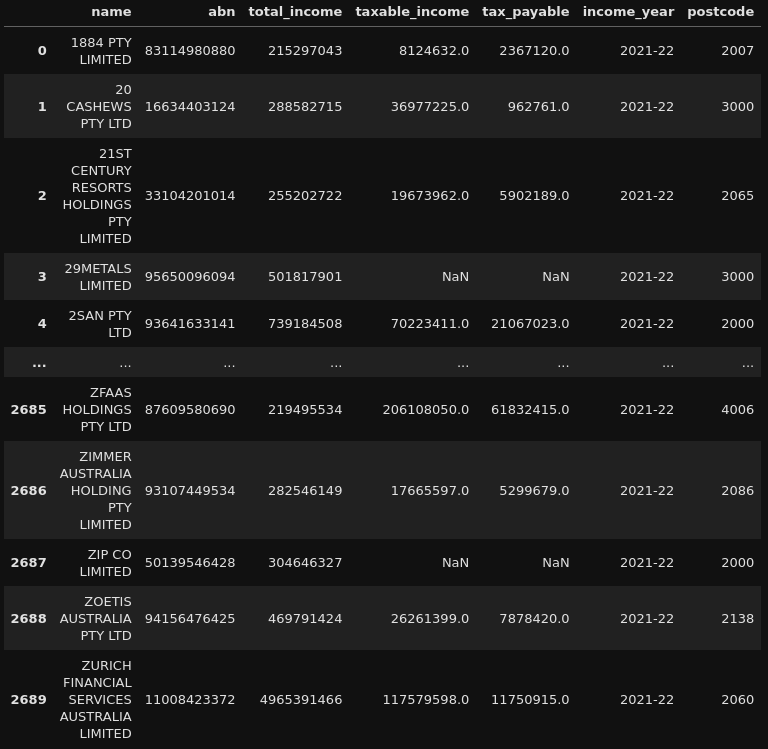
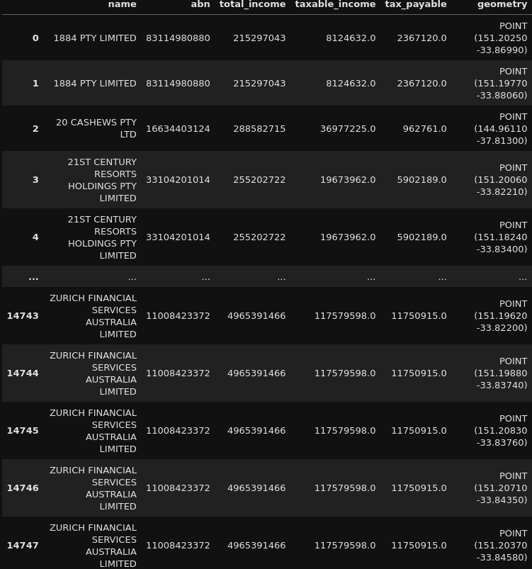
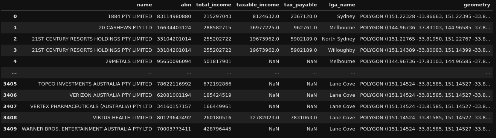
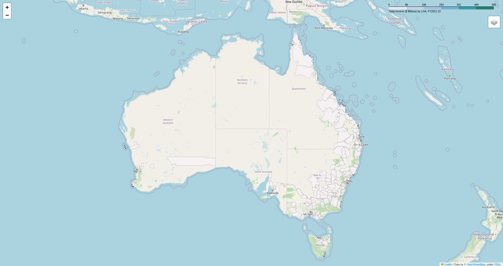

+++
title = 'Geospatial Corporate Tax Transparency Analysis (Corporate Tax Transparency Analysis - Part 3)'
date = 2024-10-20T12:12:10+11:00
draft = false
projects = ['corporate-tax-transparency-analysis']
+++

*This is the final part of a three-part series. You can find the previous part [here](https://hbbymth42.github.io/posts/abn-postcode-extractor-corporate-tax-transparency-analysis-part-2/). :)*

Alright, we're finally at the finish line! Thanks again for sticking through up to this point. This project has taken a couple of twists and turns up to now but we are now finally getting to the final analysis!

The analysis itself, on the surface and like other parts of this project, appears to be relatively simple. However, as somewhat evidenced by the combination of the previous parts, there was a bit of work to do to get up to this point.

Building on from the previous parts, we now have our dataset: The 2021-22 Corporate Tax Transparency Report, with ABN holders that have their main business locations geospatially linked to their postcodes.

For this final part, we're gonna jump straight into the code!

## The Code... that was even quicker than the previous part!

For some slight background on the data, this is what our data looks like at the moment:


The most important columns we are going to use are all of them except the name and ABN. For this project, we are going to focus on aggregating the data up to the Local Government Area (LGA) level. Hence, the name of each entity and the ABN of each entity is not relevant for this specific analysis and we will be ignoring these fields for now.

For the code, we are going to reintroduce GeoPandas to once again work with Geospatial data (for some additional background on GeoPandas, the [first part of this series](https://hbbymth42.github.io/posts/asgs-geonames-pipeline-corporate-tax-transparency-analysis-part-1/) provides a good overview of the concepts we will be covering in this part!).

We require GeoPandas for geospatial coding of relevant information, as well as for another purpose: geospatial joining (which we will get to in due course).

Remember the Shapefiles we created in the first part for the GeoNames postcodes and the ASGS boundaries? This is where they come into play.

The Shapefiles contain geometry information which represents the latitude and longitude of relevant postcodes, and the areas (which I will refer to as polygons from now) for the ASGS boundaries. The most important boundary for this project is the LGA boundary!

To get the Corporate Tax Transparency Report data geospatially coded, we simply perform a join to get the relevant defined latitude and longitude information from GeoNames, as follows:
```python
transparency_data_postcodes_gdf = (geonames_postcodes_gdf
                                   .merge(transparency_data_df, how='right', left_on='postal_cod', right_on='postcode')
                                   [['name', 'abn', 'total_income', 'taxable_income' ,'tax_payable', 'geometry']]
                                   .query('not(geometry.isna())')
                                   .drop_duplicates(ignore_index=True)
                                   .to_crs(7844)
                                  )
```
This is a simple use of ```.merge``` to perform a right join of the geonames postcodes data to the Corporate Tax Transparency Data, using Postcode as our join key. We also make sure that the coordinate reference system is set to 'EPSG:7844' so that the coordinate reference matches that of the ASGS boundaries. The output of this code looks like this:


Notice the geometry column on the far right? This is the most important column for this component of the project.

Now that we have our data geospatially coded based on postcode, we can now work with this data and aggregate it to the Local Government Area (LGA) level!

How do we do that? Geospatial joining!

In GeoPandas, we can perform what is termed as a '[spatial join](https://geopandas.org/en/stable/docs/user_guide/mergingdata.html#spatial-joins)'. The spatial joins themselves are performed based on a 'predicate' which is specified. Think of a predicate similar to how you would specify a left join or a right join, but geospatially!

If we think about this concept from a geospatial lens, points on a map can 'touch' each other, lines on a map can 'intersect' and, as relevant for this project, points can be contained 'within' an area (for more detail on specific predicates available in GeoPandas, see [this](https://shapely.readthedocs.io/en/latest/manual.html#binary-predicates) part of the documentation :) ).

For this project, we will use a 'within' predicate spatial join, and we can write a function to perform this join for us:
```python
def asgs_transparency_merge(transparency_gdf: gpd.GeoDataFrame, asgs_name: str, path: pathlib.PosixPath):

    asgs_gdf = (gpd.read_file(f'zip:///{path}')
                .to_crs(7844)
               )

    asgs_gdf[f'{asgs_name}_geometry'] = asgs_gdf['geometry']
    
    initial_merge_gdf = (transparency_gdf
                         .sjoin(asgs_gdf, how="left", predicate="within")
                        )
    
    initial_merge_success_gdf = (initial_merge_gdf
                                 .query('not(index_right.isna())')
                                )
    
    initial_merge_nearest_gdf = (initial_merge_gdf
                                 .query('index_right.isna()')
                                 [['name', 'abn', 'total_income', 'taxable_income', 'tax_payable', 'geometry']]
                                 .sjoin_nearest(asgs_gdf, how="left")
                                )
    
    merge_gdf = (pd.concat([initial_merge_success_gdf, initial_merge_nearest_gdf])
                 [['name', 'abn', 'total_income', 'taxable_income', 'tax_payable', asgs_gdf.columns[1], asgs_gdf.columns[-1]]]
                 .rename(columns={asgs_gdf.columns[1]: f'{asgs_name}_name', f'{asgs_name}_geometry': 'geometry'})
                 .drop_duplicates(ignore_index=True)
                )
    return merge_gdf
```

This function allows us to specify an ASGS Shapefile we would like to spatial join (```.sjoin()```) to our Corporate Tax Transparency Data... However, with the given predicate we have chosen, there can be some data which does not get merged with a simple ```.sjoin```.

Utilising a 'within' predicate means that **only** points within an area will be merged, but if a point is on the perimeter of a boundary or multiple boundaries, the spatial join will not be successful.

We remediate this by utilising ```.sjoin_nearest()```. This spatial join will merge the specific point to the nearest area/s. Since postcode latitudes and longitudes can be on the perimeter of multple LGA boundaries, this means that a postcode can be allocated to multiple LGAs. Hence, we have more complete data at the expense of storing more/duplicate data.

For this project, we can make this trade-off.

Specifying the LGA Shapefile as the area we want to spatial join on gives us the following:


Alright, all that's left to do now is aggregate the relevant metrics (total income, total taxable income and total tax payable), and produce some maps!

I'll provide one example of the aggregation as well as the mapping, as the code for mapping each metric I want to look at is effectively the same. Let's go with mapping total income by LGA!

First, aggregation:
```python
transparency_lga_total_income_gdf = (transparency_lga_gdf
                                     [['lga_name', 'geometry', 'total_income']]
                                     .dissolve(by='lga_name', aggfunc={'total_income': 'sum'})
                                     .assign(total_income_bill=lambda x:x['total_income'] / 1000000000)
                                     .reset_index()
                                     [['lga_name', 'geometry', 'total_income_bill']]
                                    )
```

The aggregation performed here is a simple summation of total income for each ABN holder by relevant LGA. The significant figure of the total income summation is then changed to AUD$ billions. This is done to make the scale of the map more readable :).

To make the map, we can use a Python library called [Folium](https://python-visualization.github.io/folium/latest/), which is a library based on the Leaflet.js library to produce interactive geospatial maps.

This is done like so:
```python
lga_map = folium.Map(location=(-25, 135), zoom_start=5)

lga_name = folium.features.GeoJson(
    transparency_lga_total_income_gdf,
    control=False,
    style_function=lambda x: {'fillColor': '#ffffff', 
                            'color':'#000000', 
                            'fillOpacity': 0.1, 
                            'weight': 0.1},
    tooltip=folium.features.GeoJsonTooltip(
        fields=['lga_name', 'total_income_bill'],
        aliases=['LGA Name: ', 'Total Income ($ Billions): '],
        style="""
            background-color: white;
            color: #333333;
            font-family: arial;
            font-size: 12px;
            padding: 10px;
            """,
        localize=True
    )
)

folium.Choropleth(
    geo_data=transparency_lga_total_income_gdf,
    name="choropleth",
    data=transparency_lga_total_income_gdf,
    columns= ["lga_name","total_income_bill"],
    key_on="feature.properties.lga_name",
    fill_color="PuBuGn",
    fill_opacity=0.7,
    line_opacity=0.1,
    bins=6,
    legend_name="Total Income ($ Billions) by LGA, FY2021-22",
    highlight=True
).add_to(lga_map)

lga_map.add_child(lga_name)
folium.LayerControl().add_to(lga_map)

lga_map.save('total_income_by_lga_2021-22.html')
```

The map specifically produced by the above code is a Choropleth Map where the colours of relevant LGA areas are allocated based on the quantity/amount in a specified column (in this case, total income by LGA). The map produced is then saved to a HTML file for later viewing!

This HTML file looks like this:


This map is able to be interacted with and moved around and, as noted by the scale on the top right, the higher the total income for an LGA is, the more green that area becomes on the map.

This screenshot unfortunately does not do this map justice so to see this map, I would recommend looking at the [GitHub repository](https://github.com/hbbymth42/corporate_tax_transparency_analysis) where the code (and even the other maps) are stored!

## The Actual Conclusion!
And... that's the end! Thank you so much for sticking with this project this far.

This one was a bit of a maze to navigate but overall, I found it to be a very interesting case study on what can be done with geospatial data in Python!

Hopefully you got something out of reading all of these posts and if you want to see more posts/projects, feel free to go to either the Projects or Posts pages via the relevant buttons in the navigation bar!

To get a more detailed view of the relevant code required for this project, you can find the relevant GitHub repos below:
- [ASGS Geonames Pipeline](https://github.com/hbbymth42/asgs_geonames_pipeline)
- [ABN Postcode Extractor](https://github.com/hbbymth42/abn_postcode_extractor)
- [Geospatial Corporate Tax Transparency Analysis](https://github.com/hbbymth42/corporate_tax_transparency_analysis)

Happy geospatial travels!

-- HobbyMath42
